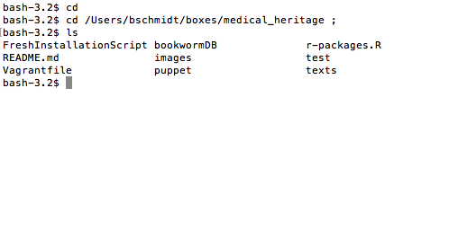

This provides a self-contained virtual environment we'll be using for our workshops.


# Installation

Requirements: this is meant to run on almost any system. However, you will need a substantial amount of RAM (4 GB) and disk space (5 GB). Installation will take a couple hours: it's probably easiest to do this before you go to bed, and leave it running overnight.

1. Install [Vagrant](https://www.vagrantup.com/downloads).
2. Install [VirtualBox](https://www.virtualbox.org/wiki/Downloads).
3. Download [this repository as a zip archive](https://github.com/bmschmidt/medicalHeritageVM/archive/master.zip) and unzip it.
4. Here things get a little different between Windows and Mac.
    * (Mac) Open the Terminal application. This is located inside your Utilities folder, or you can just search for "Terminal" using the Spotlight application on your Mac. The terminal gives you a low-level interface to your system. Type the letters `cd` ("change directory") followed by a space, and then enter the full path of the new folder you just unzipped. The easiest way to do this is grab the folder icon of the unzipped folder with the mouse from the window bar, and drag it into your terminal window. 
    
    The result should be something like "`/Users/YOURUSERNAME/Downloads/medicalHeritageVM`"
    * (Windows) Open a command window. Change to the folder you unzipped the archive into. **MORE SPECIFIC INSTRUCTIONS???**
5. 
    * (Mac, Optional) Just to make sure you're in the right place, type `ls`. You should see the names of a number of files, one of which is called "Vagrantfile". If don't but you see a file called "medicalHeritageVM," you're one level too high: go back to step 4 and drag from **inside** the unzipped folder, **not** the folder that contains the zipfile.
    * (Windows) Double check that you're in the right place.
6. Enter the command: `vagrant box add ubuntu/wily64` and press Return.
7. Enter the command: `vagrant up` and press Return.
8. Go to bed, or out for a leisurely dinner, or something. Now begins a long process of downloading and installing software. This will require a large amount of disk space and time to complete. You will know it is finished when you get a new command prompt (and hopefully no error messages). There *will* be a large number of messages printed to your screen in any case. Just ignore them.
9. Make sure you have the necessary files. In that same unzipped folder, there should be folders called "texts" and "images". Open each of them, and make sure that
      a. There's a folder in "images" called "jpeg" that has a bunch of journal pages in it
      b. There's a folder in "texts" called sample_data that has two folders with the full runs of a few medical journals.


# More details

For those curious about some more of the features, read on. But as long as the downloads are accomplished, You can rest safe for the session.

# Testing

1. Open your web browser and visit `http://localhost:8007/D3`. You should see a bar graph giving the names of the authors of the Federalist papers: type "upon" into the box and see if the bars move.
1. Open your web browser and visit `http://localhost:8787`. You should see an RStudio login screen. Enter username `vagrant` and password `vagrant` and log in. You should now see a three-paned RStudio window.

# Starting and stopping the virtual machine

Before you can use RStudio in your web browser, you have to start the virtual machine. That is what `vagrant up` does. (It's much faster after the first time, because there's no new software to install.) Once you are done working, you will want to reclaim the (large) amount of RAM required to run all this software locally. That is the purpose of the command `vagrant halt`.

# Saving your work

When you are working in RStudio Server, your files live on the virtual machine's virtual hard drive. How do you get those files off the virtual machine and back to your regular hard drive so you can print them, e-mail them, back them up, etc.? The answer is that a special folder is *shared* between the virtual machine and your real hard drive. This is `/vagrant`. Any file you save there on the virtual machine will appear in the folder where you saved the `Vagrantfile`. The same process works in reverse.

Because `/vagrant` itself is cluttered with the files for running the vritual machine (`Vagrantfile`, etc.), you'll find it convenient to create a subfolder of this directory and use *that* as your usual working directory.


## Attributions 

This configuration is based on a repository by [Dieter Menne](https://bitbucket.org/dmenne/rstudio-shiny-server-on-ubuntu) and then heavily modified by Andrew Goldstone, who also made use of work by [Lincoln Mullen](https://github.com/lmullen/vagrant-r-dev/).

# What's installed and how to modify it

In case anyone wants to fork this repository for their own courses or other purposes, here's a little more detail about what's installed:

## The virtual machine

The machine is the `ubuntu/wily64` box [on Atlas](https://atlas.hashicorp.com/ubuntu/boxes/wily64), i.e. Ubuntu 15.10.

The machine is configured with 2GB of RAM, which is fine for most pedagogical purposes. Some students will need to reduce this allocation before the VM can fit in their machine's physical RAM. Conversely, the matrices and arrays required for topic-modeling with MALLET consume a lot of RAM and may require a larger allocation. Edit the line in [Vagrantfile](Vagrantfile#L11) reading

````
      v.memory = 2048
````

to change the allocation. The number is in megabytes. Use `vagrant reload` for the configuration to take effect.

## User accounts

The machine configuration is governed by a Puppet manifest, [rstudio-server.pp](puppet/manifests/rstudio-server.pp). The puppet script is creates a single user, `vagrant`, which is also the RStudio Server user. Don't deploy this image to the cloud (or to unsecured lab machines) without some better security configuration, since the username and password are here in the clear. 

## Software

 It installs (not exactly in this order):

1. The latest available R

3. RStudio Server. The version is hardcoded, but you can change it by editing the [line in the manifest](puppet/manifests/rstudio-server.pp#L3) that sets `$rstudioserver` (or change the full download URL by also changing `$urlrstudio`).

4. Various supporting libraries, languages, and tools: Java, python, libxml2, Make, and so on.

5. Some sample data files.

6. R packages. Finally, the Puppet manifest causes a set of R packages to be installed. This process is governed by an R script, [r-packages.R](r-packages.R). There's nothing sophisticated here, just a list of packages to be installed from CRAN (in the variable `packages`). In principle, `vagrant provision` will cause these to be upgraded if more recent versions are available than those that are installed.
