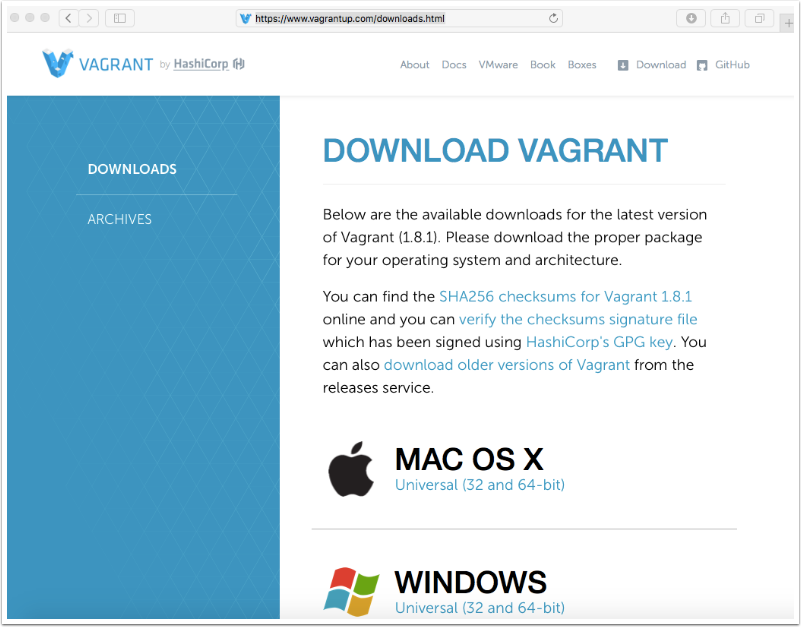
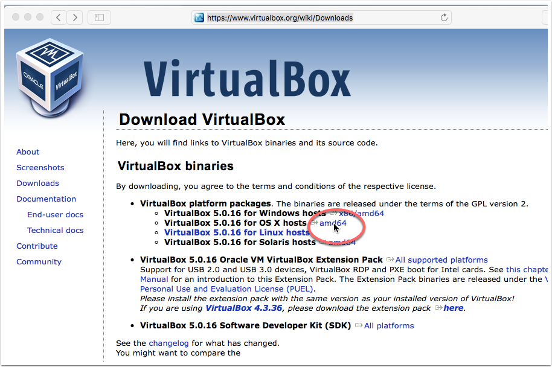
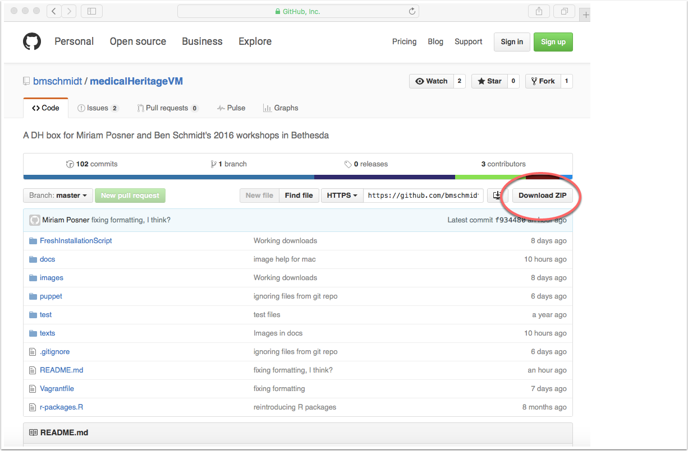
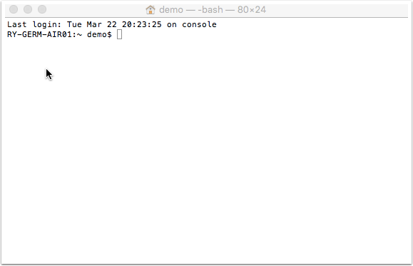
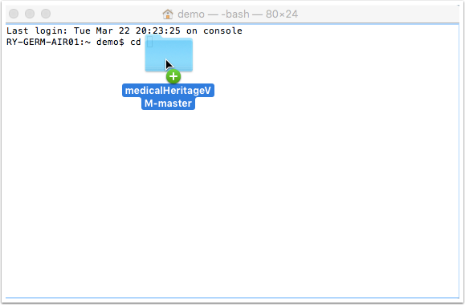
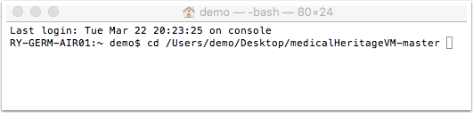
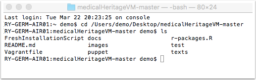
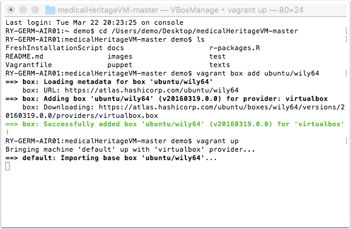
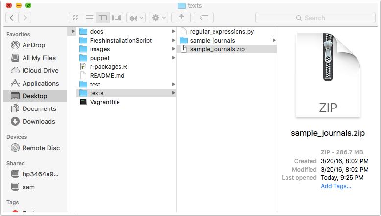
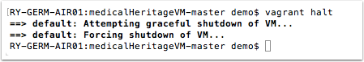

Set up the Medical Heritage Virtual Machine {#set-up-the-medical-heritage-virtual-machine-mac .ArticleHeading}
=================================================

In our workshop at the National Library of Medicine, we'll learn how to
use special software for mining images and texts. The problem is that
this software has lots of **dependencies** -- things that need to be
installed in order for it to work -- and the process for installing of
this stuff is time-consuming and varies across different computers.

To simplify things, Ben and Miriam have set up a **virtual machine**,
meaning a computer you install on *your* computer, that's set up with
everything you need. In order to install the virtual machine on your
computer, you'll first download some necessary software and files, and
then download the VM itself.<span id="Step10" class="anchor"></span>

In order to install this software, you'll need:
* a fair amount of space on your computer (about 5GB) and a fair amount of RAM (about 4GB). [Find out how much RAM your Mac has.](http://www.macinstruct.com/node/422) [Find out how much RAM your PC has.](http://windows.microsoft.com/en-us/windows/how-much-computer-ram#1TC=windows-7) [Find out how much disk space your Mac has.](http://www.macinstruct.com/node/414) [Find out how much disk space your PC has.](http://windows.microsoft.com/en-us/windows-vista/view-the-amount-of-free-space-on-your-hard-disk)
* a stable Internet connection. If your Internet connection gets interrupted, it could cause some hiccups with the installation process. So it's best if you can count on a stable Internet connection for at least a few hours.
* some time. Depending on various factors, this process could take anywhere from 45 minutes to a few hours.'

1. Install Vagrant
------------------

Vagrant is the software we'll use to set up the virtual machine. You can
download it just like you download any piece of software. In your
browser, go to <https://www.vagrantup.com/downloads.html> and download
the MacOS version. Once you've finished downloading Vagrant, install the
software by double-clicking the package you downloaded, double-clicking
Vagrant.pkg, and following the steps in the Vagrant Installer that
launches.


<span id="Step11" class="anchor"></span>

2. Install VirtualBox
---------------------

VirtualBox is the second piece of software you'll use to set up your
virtual machine. Point your browser to
<https://www.virtualbox.org/wiki/Downloads> and download the version for
Mac. Once you've finished downloading VirtualBox, install the software
by double-clicking the package you downloaded, double-clicking
VirtualBox.pkg, and following the steps in the VirtualBox Installer that
launches.


<span id="Step1" class="anchor"></span>

3. Download the zipped folder containing the setup instructions
---------------------------------------------------------------

Go to <https://github.com/bmschmidt/medicalHeritageVM> and click on the
**Download Zip** button to download a zipped version of the setup
instructions for the virtual machine we're using. Unzip the folder after
you've downloaded it.

Make a note of where you saved the folder, which is called
**medicalHeritageVM-master**. On most Macs, things get saved to the
Downloads folder by default. That's OK, but I'm going to drag the folder
to my **Desktop**, just to make it a little easier to find.


<span id="Step2" class="anchor"></span>

4. Open your Terminal
---------------------

**Terminal** is an application on your Mac that allows you to interact
with your computer using written commands. It lives inside your
**Utilities** folder (inside **Applications**), or, to simplify things,
you can just search for it using your Mac's Spotlight search tool.

In the image you see here, your terminal is showing you a **command
prompt**, meaning it's waiting for you to give it instructions. You can
tell it's a command prompt because of the dollar sign (**\$**) after the
username.


<span id="Step3" class="anchor"></span>

5. Navigate to the folder you downloaded in step three 
------------------------------------------------------

This is the hardest thing you'll do in this installation process! We
need to use the **Terminal** to navigate into the folder you downloaded
in **Step Three**. Luckily, Macs make this pretty easy to do.

Just after the dollar sign in your terminal, type the letters **cd**
followed by a space. ("CD" stands for "change directory.") Then,
remember where you saved the folder you downloaded in Step Three. (As
you'll recall, the folder is called **medicalHeritageVM-master**.) Drag
the icon for that folder into the terminal and drop it there.


<span id="Step4" class="anchor"></span>

6. This is what your terminal should look like after you drop the folder 
------------------------------------------------------------------------

As you can see, your **Terminal** has helpfully supplied the **path** to
the folder you just dopped into it. (A **path** works like a URL; it
tells the computer where to go.) If your terminal looks something like
mine, go ahead and press **return**. You've completed the hardest part!


<span id="Step5" class="anchor"></span>

7. Check to see what's in the folder
------------------------------------

After you've pressed return, notice that the command prompt changes a
little bit to show that you're inside the medicalHeritageVM-master
folder. Let's see what's inside the folder. To do that enter the letters
**ls**, followed by **return**. ("LS" means **list files** inside
whatever folder you're in.) You should see a list of files that looks
like the list pictured in the image below.


<span id="Step7" class="anchor"></span>

8. Tell Vagrant to download our computing environment
-----------------------------------------------------

Now that we've downloaded the right software and made our way into the
right folder, let's download the computing environment -- that is, the
operating system plus the specific software and files -- we need so that
everyone's on the same page at the workshop. Luckily, the file you
downloaded in step three contains instructions for your computer that
tells it how to get everything set up.

Getting this started is simple: just enter vagrant up and press return.
Then it will take a long time for everything to download. You'll
probably want to let this run and come back to it later. The process can
take anywhere from half an hour to three hours.

While this is happening, your terminal screen will fill up with many
messages. Some of them look alarming and say "Error," but that's OK. You
shouldn't need to worry about them, but it you want, you can pretend
you're typing them and impress onlookers by looking like a hacker.

When this process is complete, you'll see the command prompt again (your
name followed by the dollar sign).


<span id="Step8" class="anchor"></span>

9. Check to make sure Vagrant downloaded everything you need
------------------------------------------------------------

Within the medicalheritageVM-master file you downloaded in Step Three,
you'll find an **images** folder and a **texts** folder. Open the
**texts** folder. You should see a file called **sample\_journals.zip**.
(In the image below, I've unzipped it.) That contains the journals
you'll use during Ben's portion of the workshop.

In the **images** folder, you'll see a zipped file called **xray**,
which will unzip into a folder called **jpeg**. That folder should
contain many images of journal pages, which you'll use during Miriam's
portion of the workshop.


<span id="Step9" class="anchor"></span>

10. Put your VM to sleep 'til you need it again
-----------------------------------------------

From here on out, it'll be much faster to get your virtual machine up
and running (which you'll do by typing vagrant up) because everything
you need is already downloaded. Let's put our virtual machine to sleep
for now, to save memory. To do that, type vagrant halt into your
Terminal.

Now you're all set! Leave the medicalheritageVM-master folder in place,
because we'll be using it again during the workshop.




# More details

For those curious about some more of the features, read on. But as long as the downloads are accomplished, You can rest safe for the session.

# Testing

1. Open your web browser and visit `http://localhost:8007/D3`. You should see a bar graph giving the names of the authors of the Federalist papers: type "upon" into the box and see if the bars move.
1. Open your web browser and visit `http://localhost:8787`. You should see an RStudio login screen. Enter username `vagrant` and password `vagrant` and log in. You should now see a three-paned RStudio window.

# Starting and stopping the virtual machine

Before you can use RStudio in your web browser, you have to start the virtual machine. That is what `vagrant up` does. (It's much faster after the first time, because there's no new software to install.) Once you are done working, you will want to reclaim the (large) amount of RAM required to run all this software locally. That is the purpose of the command `vagrant halt`.

# Saving your work

When you are working in RStudio Server, your files live on the virtual machine's virtual hard drive. How do you get those files off the virtual machine and back to your regular hard drive so you can print them, e-mail them, back them up, etc.? The answer is that a special folder is *shared* between the virtual machine and your real hard drive. This is `/vagrant`. Any file you save there on the virtual machine will appear in the folder where you saved the `Vagrantfile`. The same process works in reverse.

Because `/vagrant` itself is cluttered with the files for running the vritual machine (`Vagrantfile`, etc.), you'll find it convenient to create a subfolder of this directory and use *that* as your usual working directory.


## Attributions 

This configuration is based on a repository by [Dieter Menne](https://bitbucket.org/dmenne/rstudio-shiny-server-on-ubuntu) and then heavily modified by Andrew Goldstone, who also made use of work by [Lincoln Mullen](https://github.com/lmullen/vagrant-r-dev/).

# What's installed and how to modify it

In case anyone wants to fork this repository for their own courses or other purposes, here's a little more detail about what's installed:

## The virtual machine

The machine is the `ubuntu/wily64` box [on Atlas](https://atlas.hashicorp.com/ubuntu/boxes/wily64), i.e. Ubuntu 15.10.

The machine is configured with 2GB of RAM, which is fine for most pedagogical purposes. Some students will need to reduce this allocation before the VM can fit in their machine's physical RAM. Conversely, the matrices and arrays required for topic-modeling with MALLET consume a lot of RAM and may require a larger allocation. Edit the line in [Vagrantfile](Vagrantfile#L11) reading

````
      v.memory = 2048
````

to change the allocation. The number is in megabytes. Use `vagrant reload` for the configuration to take effect.

## User accounts

The machine configuration is governed by a Puppet manifest, [rstudio-server.pp](puppet/manifests/rstudio-server.pp). The puppet script is creates a single user, `vagrant`, which is also the RStudio Server user. Don't deploy this image to the cloud (or to unsecured lab machines) without some better security configuration, since the username and password are here in the clear. 

## Software

 It installs (not exactly in this order):

1. The latest available R

3. RStudio Server. The version is hardcoded, but you can change it by editing the [line in the manifest](puppet/manifests/rstudio-server.pp#L3) that sets `$rstudioserver` (or change the full download URL by also changing `$urlrstudio`).

4. Various supporting libraries, languages, and tools: Java, python, libxml2, Make, and so on.

5. Some sample data files.

6. R packages. Finally, the Puppet manifest causes a set of R packages to be installed. This process is governed by an R script, [r-packages.R](r-packages.R). There's nothing sophisticated here, just a list of packages to be installed from CRAN (in the variable `packages`). In principle, `vagrant provision` will cause these to be upgraded if more recent versions are available than those that are installed.
